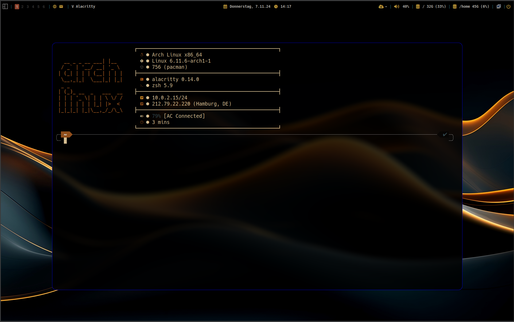

# My Linux Arch Post Installation

This script will config and install software to a fresh linux arch system.

The following steps will bve executed by default:
- configure pacman 
- install paru as AUR helper
- install and start the following services
    - cups service
    - docker service
    - ssh service
    - ntp service
    - lightdm service
- install software packages
- copy the dotfiles for the following applicatins
    - alacritty
    - dunst
    - fastfecth
    - nvim
    - picom
    - qtile
    - zsh

To start the installation script run ```install.sh```

## Final result
